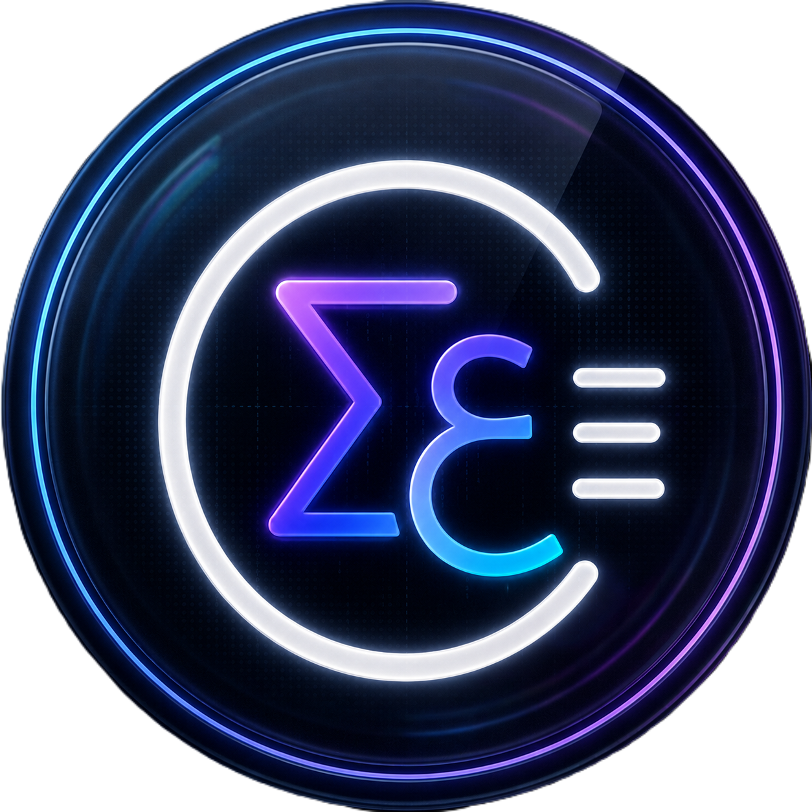

<h1>
  
  My Portfolio
</h1>

My premium personal portfolio with glassmorphism design, multi-language support (EN/AR), a secure admin dashboard, and real-time interaction.

<p>
  
  
  
  
  
  
  
</p>

🌐 **Live:** [omar-el-khouly.vercel.app](https://omar-el-khouly.vercel.app)

---

## Features

| Feature | Description |
|---|---|
| **Glassmorphism UI** | Modern design with smooth animations (Framer Motion, GSAP, AOS, Lottie) |
| **Multi-Language** | Fully translated English & Arabic with RTL support |
| **Admin Dashboard** | Secure management of projects, certificates, and comments |
| **Real-time Comments** | Integrated comment system with pin/unpin and freeze controls |
| **Supabase Backend** | Database, authentication, and storage via Supabase |
| **PWA** | Installable progressive web app with offline support |
| **SEO Optimized** | Meta tags, sitemap, and robots.txt configured |

## Tech Stack

| Layer | Library / Tool |
|---|---|
| **Framework** | [React 18](https://react.dev) + [Vite](https://vite.dev) |
| **Styling** | [Tailwind CSS](https://tailwindcss.com) + [Material UI](https://mui.com) + [Headless UI](https://headlessui.com) + [Shadcn/UI](https://ui.shadcn.com) |
| **Animations** | [Framer Motion](https://www.framer.com/motion), [GSAP](https://gsap.com), [AOS](https://michalsnik.github.io/aos/), [Lottie](https://airbnb.io/lottie/) |
| **Backend** | [Supabase](https://supabase.com) (Auth, DB, Storage, Realtime) |
| **Alerts** | [SweetAlert2](https://sweetalert2.github.io) |
| **Fonts** | Poppins (Latin), Cairo (Arabic) |

## Structure

```
my-portfolio/
├── public/
│   ├── tools/              # Tech stack icons (SVG + PNG)
│   ├── icon.png            # App icon
│   ├── Meta.png            # Open Graph image
│   ├── Coding.gif          # Animated hero asset
│   ├── manifest.json       # PWA manifest
│   └── sitemap.xml
├── src/
│   ├── components/         # Shared components (Navbar, Footer, Modal, etc.)
│   ├── Pages/              # Page components (Home, About, Portfolio, Contact, CV)
│   │   └── dashboard/      # Admin dashboard pages
│   ├── context/            # Theme context
│   ├── hooks/              # Custom hooks
│   ├── assets/             # Static assets
│   ├── App.jsx
│   ├── main.jsx
│   └── index.css           # Global styles & theme variables
├── index.html
├── vite.config.ts
└── package.json
```

## Getting Started

### Prerequisites
- Node.js 18+
- A [Supabase](https://supabase.com) project (free tier)

### Install

```bash
git clone https://github.com/Omar-Khaled-57/my-portfolio.git
cd my-portfolio
npm install
```

### Environment

Create `.env`:
```env
VITE_SUPABASE_URL=your_supabase_url
VITE_SUPABASE_ANON_KEY=your_supabase_anon_key
```

### Run

```bash
npm run dev
```

Build for production:
```bash
npm run build
```

## Supabase Setup

Run the SQL in `README.md` (or copy from this file) to create tables, enable RLS, and configure storage buckets. Then create your admin user via **Authentication → Users**, copy their UUID, and insert into `profiles`:

```sql
INSERT INTO public.profiles (id, username, role)
VALUES ('YOUR_USER_ID', 'admin', 'admin');
```

## License

This project is for personal use. Feel free to use it as inspiration for your own portfolio!

## Contact

Me — [GitHub](https://github.com/Omar-Khaled-57) · [WhatsApp](https://wa.me/201123029406) · [Portfolio](https://omar-el-khouly.vercel.app)
